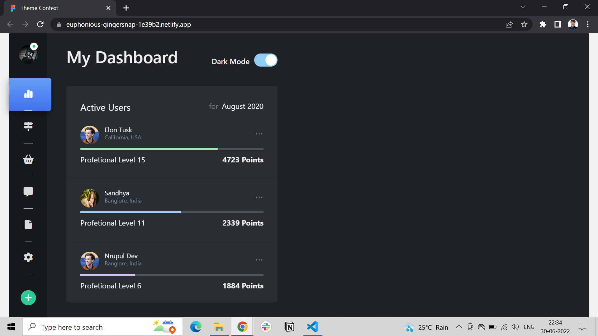
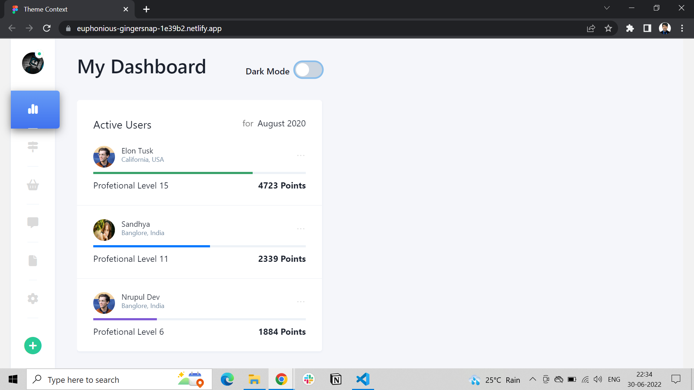

## Toggle Theme mode

- In this assignment we were given a Figma mockup template to design that and change or we can say toggle theme `Dark` and `Light` mode. 
- [Figma mockup template](https://www.figma.com/file/lJGCvrYfOkwHXjmExYbTyv/Web-Dashboard-%26-Statistics-UI-Kit-App-Template-1?node-id=2%3A2)
- Click on above link to see original given template.

### Tech stack used to buld these template is as below-
- React
- Context API 
- Styled components to achive good stylling.
- Chakra ui

### Dark Theme

### Light Theme

### Deployed link 
- You can use below link to take demo
- [https://euphonious-gingersnap-1e39b2.netlify.app/](https://euphonious-gingersnap-1e39b2.netlify.app/)